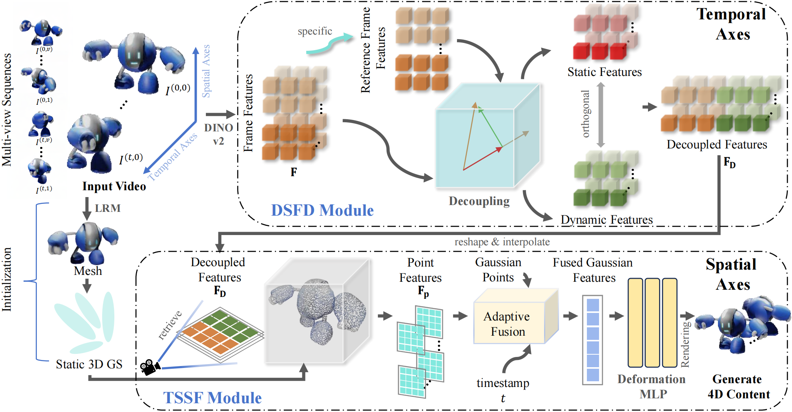
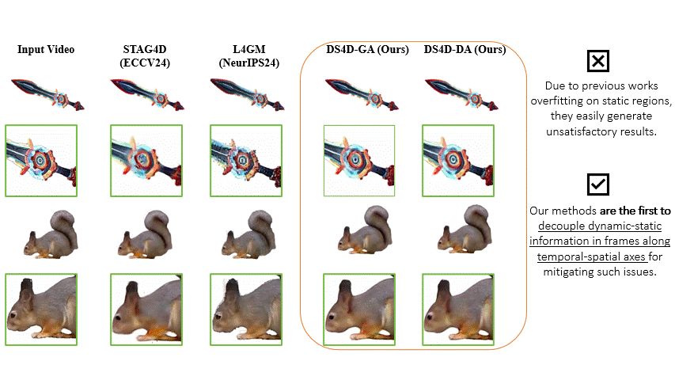

## ***Not all Frame Features are Equal: Video-to-4d Generation via Decoupling Dynamic-static Features***

<div>
<div align="center">
    <a href='https://github.com/LiyingCV' target='_blank'>Liying Yang</a><sup>1,</sup>&emsp;
    <a href='https://scholar.google.com.hk/citations?user=HmvE2WsAAAAJ&hl=zh-CN' target='_blank'>Chen Liu</a><sup>2,</sup>&emsp;
    <a href='https://github.com/GaryZhu1996' target='_blank'>Zhenwei Zhu</a><sup>1,</sup>&emsp;
    <a href='https://scholar.google.com.hk/citations?user=isWtY64AAAAJ&hl=zh-CN' target='_blank'>Ajian Liu</a><sup>3,</sup>&emsp;
    Hui Ma</a><sup>1,</sup>&emsp;
    Jian Nong</a><sup>1,</sup>&emsp;
    <a href='https://scholar.google.com.hk/citations?user=-LEgoWMAAAAJ&hl=zh-CN' target='_blank'>Yanyan Liang</a><sup>1,†</sup>
</div>
<div>
<div align="center">
    <sup>1</sup>Macau University of Science and Technology&emsp;
    <sup>2</sup>The University of Queensland&emsp;
    <sup>3</sup>Institute of Automation, Chinese Academy of Sciences
</div>
<div align="center">
<sup>†</sup>Corresponding Author
</div>

<p align="center">
  <a href="https://arxiv.org/abs/2502.08377" target='_blank'>
    
  </a>
  <a href="https://github.com/LiyingCV/DS4D" target='_blank'>
    
  </a>
  
<div align="center">
    ICCV Highlight🔥
</div>

<div style="text-align:center">

</div>

## Example

 


## 🛠️ The codes and datasets will be released after we clean down
### Installation
The environment was tested on NVIDIA 4090, A100, A10, 3090, and Tesla V100. 

Clone the code repository
```
git clone https://github.com/LiyingCV/DS4D.git
```

Create a new environment from ```environment.yml```
```
conda env create -f environment.yml
conda activate ds4d
```

Install Gaussian splatting and simple-knn
```
pip install ./diff-gaussian-rasterization
pip install ./simple-knn
```

Install pointnet2_ops
```
cd tgs/models/snowflake/pointnet2_ops_lib && python setup.py install && cd -
```

Install [PyTorch3D](https://github.com/facebookresearch/pytorch3d/blob/main/INSTALL.md)

### Prepare data
Before starting training, we first use [InstantMesh](https://github.com/TencentARC/InstantMesh) to reconstruct the 3D object of the middle frame. For more details about how to reconstruct, please refer to InstantMesh. Then, we need to scale and rotate the 3D object to fit Gaussian splatting. By the way, we can also use other 3D reconstruction models or 3D generation models to produce the 3D object, while we use InstantMesh in the paper.


### Training
During trainig, the code will produce the result of 360° video and front/back/left/right video.
```
python runner.py --config /path/to/config/ --item /the/name/of/item/
```
## 📚 Citation
If you find our work useful for your research, please consider citing our paper:

```
@InProceedings{Yang_2025_ICCV,
    author    = {Yang, Liying and Liu, Chen and Zhu, Zhenwei and Liu, Ajian and Ma, Hui and Nong, Jian and Liang, Yanyan},
    title     = {Not All Frame Features Are Equal: Video-to-4D Generation via Decoupling Dynamic-Static Features},
    booktitle = {Proceedings of the IEEE/CVF International Conference on Computer Vision (ICCV)},
    month     = {October},
    year      = {2025},
    pages     = {7494-7504}
}
```
